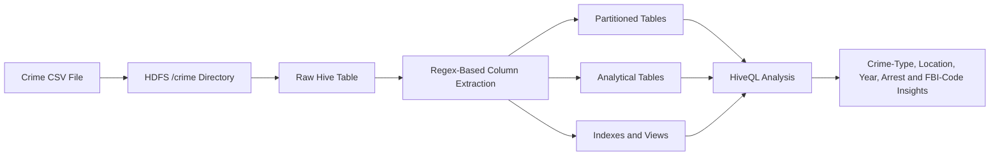

# Crime Data Analysis Using Hadoop and Apache Hive

A big-data analytics project that loads a large crime-record CSV dataset into HDFS and uses Apache Hive to create analytical tables, partitions, indexes, views, joins, rankings, and grouped crime statistics.

## Project Objective

The project demonstrates how distributed storage and SQL-style analysis can be used to explore a large crime dataset containing attributes such as:

- Crime ID
- Case number
- Date
- Block
- IUCR code
- Primary crime type
- Description
- Location description
- Arrest indicator
- Domestic indicator
- Beat
- FBI code
- Year

The analysis focuses on crime frequency by type, location, year, arrest status, domestic status, and related classifications.

## Architecture



## Workflow Demonstrated

### 1. Store Data in HDFS

```bash
start-all.sh
jps
hadoop fs -mkdir /crime
hadoop fs -put /path/to/crimes.csv /crime/
```

### 2. Create the Hive Database

```sql
SHOW DATABASES;
CREATE DATABASE crime;
USE crime;
```

### 3. Load the Raw File

```sql
CREATE TABLE crime_table (col_value STRING);

LOAD DATA INPATH '/crime/crimes.csv'
OVERWRITE INTO TABLE crime_table;
```

The report loads each CSV record as a raw string and then uses `regexp_extract` to populate structured analytical tables.

### 4. Build Structured Tables

The project creates tables for different analytical purposes, including:

- Case number, description, arrest status, and year
- Crime type and location
- FBI code analysis
- Block, IUCR, crime type, and description
- Location, arrest, domestic flag, and beat

### 5. Partition Data by Year

```sql
CREATE TABLE crime_part1 (
    Case_Number STRING
)
PARTITIONED BY (Year INT);

SET hive.exec.dynamic.partition.mode=nonstrict;

INSERT OVERWRITE TABLE crime_part1
PARTITION (Year)
SELECT Case_Number, Year
FROM crime1
WHERE Year BETWEEN 2000 AND 2017;
```

### 6. Query and Rank Crime Patterns

The report demonstrates HiveQL for:

- Total crime counts
- Year-specific counts
- Theft counts
- Crime counts by location and crime type
- Ranking primary crime types
- Ranking location descriptions
- Burglary on streets
- FBI-code frequencies
- Year-, type-, and description-level aggregation
- Arrest and domestic-crime filtering

Example:

```sql
SELECT
    Primary_Type,
    COUNT(Case_Number) AS total_cases,
    RANK() OVER (ORDER BY COUNT(Case_Number) DESC) AS crime_rank
FROM crime2
GROUP BY Primary_Type;
```

The ranking output shown in the report identifies **theft, battery, criminal damage, narcotics, and other offense** among the most frequent primary categories in the loaded data.

### 7. Create Views and Join Tables

```sql
CREATE VIEW crime_000 AS
SELECT *
FROM crime_c;
```

The project also demonstrates joins between structured crime tables:

```sql
SELECT
    c.Block,
    c.IUCR,
    o.Primary_Type
FROM crime_c2 c
JOIN crime3 o
    ON c.Primary_Type = o.Primary_Type;
```

### 8. Demonstrate Hive Data Distribution Operations

The report includes examples of:

- `ORDER BY`
- `SORT BY`
- `GROUP BY`
- `CLUSTER BY`
- `DISTRIBUTE BY`
- Dynamic partitioning
- Window ranking
- Views
- Joins
- Index creation

## Technology Stack

- Apache Hadoop
- HDFS
- Apache Hive
- HiveQL
- MapReduce execution
- Linux command line
- CSV data processing
- Regular-expression-based field extraction

## Recommended Repository Structure

```text
hadoop-hive-crime-analysis/
├── README.md
├── data/
│   ├── sample_crimes.csv
│   └── data_dictionary.md
├── hive/
│   ├── 01_create_database.sql
│   ├── 02_load_raw_data.sql
│   ├── 03_create_tables.sql
│   ├── 04_partitions_and_indexes.sql
│   └── 05_analysis_queries.sql
├── screenshots/
├── reports/
│   └── crime_data_analysis_report.pdf
├── docker/
│   └── README.md
└── LICENSE
```

## Data-Quality and Documentation Note

The report contains two different date-range descriptions:

- The narrative describes records from **2012–2015**
- The Hive implementation partitions and queries data from **2000–2017**

Before publishing the repository, verify the actual source dataset and document its correct coverage, source URL, license, and row count.

## Limitations

- Parsing CSV records with regular expressions can fail when fields contain embedded commas or quoted text.
- The report uses a legacy Hive-on-MapReduce execution environment.
- The project does not include a formal data-quality layer.
- The PDF contains terminal screenshots rather than reusable `.sql` scripts.
- Some query examples should be reviewed for naming consistency and semantic correctness.
- The dataset source and license are not clearly documented in the report.

## Recommended Modernization

- Convert every Hive command into version-controlled `.sql` files
- Use Hive's CSV SerDe instead of raw-line regex parsing
- Add data validation for nulls, duplicate case numbers, and malformed rows
- Document the dataset source and data dictionary
- Add reproducible Docker or local-cluster instructions
- Compare Hive execution with Spark SQL
- Store curated data in Parquet
- Add partition-pruning and file-format benchmarks
- Create visual summaries in Power BI or Tableau

## Skills Demonstrated

- Distributed storage with HDFS
- Hive table creation and data loading
- Dynamic partitioning
- SQL aggregation and filtering
- Window functions and ranking
- Hive views and joins
- Big-data command-line workflow

